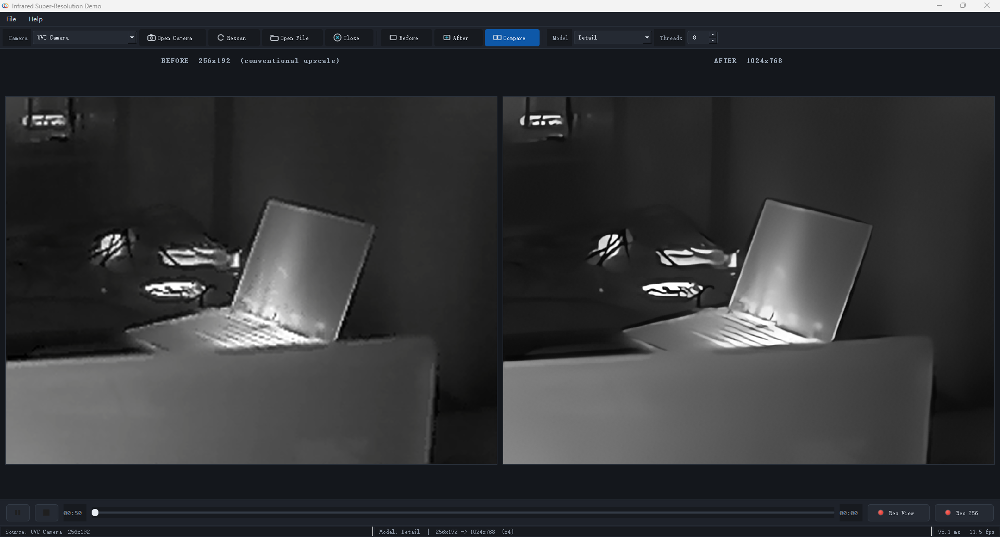
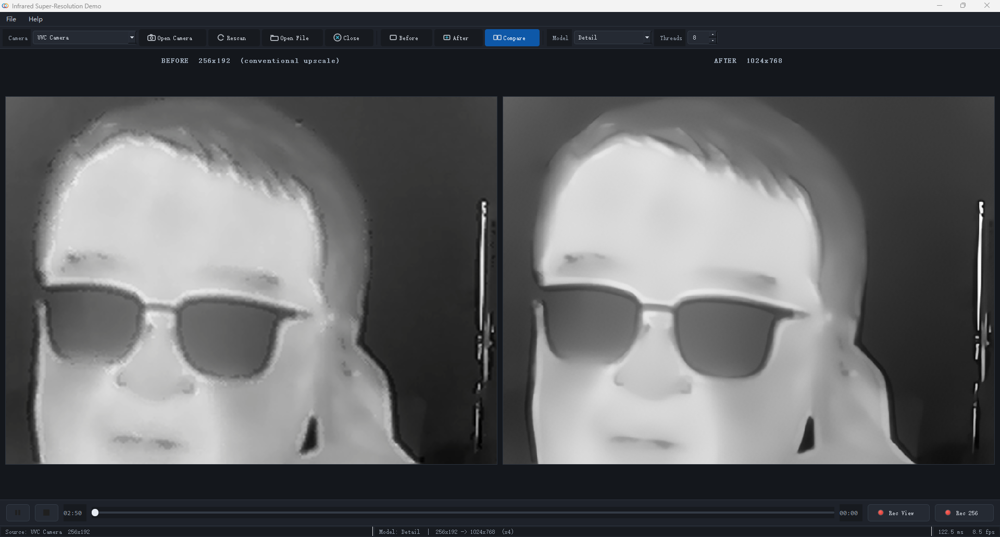

# SrDemoQt — Infrared Super-Resolution Demo

A Qt desktop application that upscales 256-wide infrared video ×4 in real time,
from a UVC camera or a video file. It is split into two projects:

```
SrDemoQt/
├── CMakeLists.txt      top-level; links SrCore from source OR prebuilt (auto)
├── SrCoreLib/          the algorithm
│   └── include/SrInterface.h   the ONLY public header  (published)
│       · src/  · res/  · CMakeLists.txt   implementation (NOT published)
├── SrDemoApp/          the user interface, full source  (published)
│   ├── CMakeLists.txt
│   └── src/
├── docs/images/        before/after comparison images for this README
└── bin/                runtime folder
    ├── SrCore.dll / SrCore.lib   prebuilt algorithm library  (published)
    └── data/ir_sample_256x192.mp4   bundled 256x192 test clip
```

> The internal tree additionally carries the algorithm implementation under
> `SrCoreLib/`. It is excluded from the public repository by `.gitignore`.

The application layer sees no implementation detail — it only knows the small
public interface in `SrInterface.h`.

> **Published form.** In the public repository `SrCoreLib` ships as its single
> public header plus a **prebuilt `SrCore.dll` / `SrCore.lib`** in `bin/` — the
> algorithm source is not distributed. The build links the prebuilt core
> automatically (see [Build](#build)). The rest of the tree — the Qt UI in
> `SrDemoApp/` — is full source.

---

## Super-resolution vs. conventional upscaling

Two live captures from the app in **Compare** mode. Each starts from the **same
256×192 infrared frame**: on the left a conventional **bicubic ×4** enlargement —
the best a normal viewer gives for free — and on the right this engine's **×4
super-resolution** at 1024×768. Same pixels in, same output size.



The blockiness of the low-resolution input on the left — stair-stepped edges and
mushy detail — resolves into clean contours on the right, with no ringing halo and
no invented texture. It is even clearer on a face:



**Why it helps on infrared in particular**

- **Small sensor, big screen.** Uncooled 256×192 cores are cheap and everywhere,
  but their picture turns blocky the instant you enlarge it. SR restores apparent
  resolution, so a low-cost core fills an HD panel cleanly — no new optics.
- **Edges you can act on.** A thermal scene is mostly smooth gradient with a few
  decisive edges (a person against a wall, a hot joint on a board). Bicubic blurs
  exactly those; the engine sharpens them without the overshoot an unsharp mask
  would add.
- **Real time, in software.** ~35 ms per ×4 frame on a desktop CPU
  (see [Measured](#measured-i7-8-threads-release-real-camera)) — live, from the
  camera you already have.
- **Detail, not invention.** The engine is tuned to sharpen real structure
  without hallucinating texture, for cases where a faithful reading matters more
  than a pretty one.

> Screenshots of the running app in **Compare** mode (highest-quality preset);
> the BEFORE / AFTER labels and the status bar are the app's own.

---

## What it does

- **Sources**: UVC camera, or a video file (`.mp4 .avi .wmv .mkv .mov`).
- **Camera check**: on *Open Camera* the resolution is verified up front — width
  must be **256** and height **≥ 192**; otherwise a dialog explains why and the
  camera is not opened.
- **Input constraint**: width must be **256**. Height ≥ engine height is accepted;
  the top rows are taken as the picture and any extra rows (sensor telemetry, or
  a stacked temperature plane) are dropped. Anything else is refused with a note.
- **View modes**: `Before` / `After` / `Compare` (side by side).
- **Transport**: Play, Pause, Resume, Stop, and a progress bar you can drag
  to scrub smoothly (file sources; disabled for a live camera).
- **Model switching**: pick a model from the toolbar; it swaps in live without
  restarting the stream.
- **Status bar**: source info · model summary · latency and frame rate.
- **Recording** (two independent buttons, both save to the `record/` folder next
  to the app — no save dialog):
  - **Rec View** captures exactly what is on screen — **Before** the input,
    **After** the result, **Compare** the side-by-side pair. The view is locked
    while it runs. Files: `record/view_<mode>_<timestamp>.mp4`.
  - **Rec 256** archives the *original* 256×192 source with minimal compression
    (intra-frame MJPEG in an .mp4, every frame preserved independently) for
    later re-processing. Files: `record/src_256x192_<timestamp>.mp4`.
- **Open Recent**: *File ▸ Open Recent* re-opens the last clips you played
  (remembered across sessions).
- **File input constraint**: only native **256×192** clips can be opened; any
  other size is refused with a note (an upscaled result or a Compare recording
  is not a valid input).
- **Help ▸ About**: Wavefront brand logo, company info, version and copyright.

The toolbar offers a few interchangeable **quality presets** under neutral
names; pick whichever balances sharpness and speed for your scene.

---

## Architecture

```
  SrDemoApp (UI)                         SrCoreLib (SrCore.dll)
  ┌────────────────────┐   frames        ┌───────────────────────┐
  │ VideoController ────┼───────────────► │ SrEngine (abstract)   │
  │  (capture + play/   │                 │                       │
  │   pause/seek)       │   SrInterface.h │  hidden implementation│
  │ SrWorker  ──────────┼───────────────► │                       │
  │  (drop-frame queue) │   result        │                       │
  │ MainWindow/ImageView│ ◄───────────────┼──                     │
  └────────────────────┘                 └───────────────────────┘
```

- **`SrInterface.h`** — the only file the app includes from the library. An
  abstract `SrEngine` plus an `SrEngineFactory`, mirroring the house style of
  `FeatureMatchLib`. Nothing but `cv::Mat` in/out crosses the boundary.
- **Drop-frame policy** — `SrWorker` keeps only the newest frame; if one arrives
  while the previous is still processing it is overwritten. This keeps the
  picture in step with the source and is the same policy used by the shipping
  products this demo derives from. Do not turn it into a queue.

---

## Build

### Prerequisites

| Dependency | Version tested                 | Notes                                   |
| ---------- | ------------------------------ | --------------------------------------- |
| Qt         | **5.15.2** (msvc2019_64) | Widgets — build + runtime              |
| OpenCV     | **4.11.0** (vc16, x64)   | `opencv_world4110` — build + runtime |
| Compiler   | MSVC 2019 (v142)               | x64                                     |
| CMake      | ≥ 3.16                        | Ninja or the VS generator               |

That is all a public checkout needs to build the app — `SrCore.dll` is already
compiled and carries its own dependencies; its runtime DLLs already sit in
`bin/` (see [Run](#run)).

Dependency roots are **cache variables** in the top-level `CMakeLists.txt`;
override them on the configure line without editing anything:
`-DOpenCV_DIR=...` (the folder holding `OpenCVConfig.cmake`) and
`-DCMAKE_PREFIX_PATH=<Qt dir>`.

### Two build modes (chosen automatically)

The top-level `CMakeLists.txt` looks for `SrCoreLib/src`:

|                      | **Prebuilt core** (this public repo)      | **From source** (internal)       |
| -------------------- | ----------------------------------------------- | -------------------------------------- |
| Trigger              | `SrCoreLib/src` absent                        | `SrCoreLib/src` present              |
| What builds          | only`SrDemoApp`                               | `SrCore` **and** `SrDemoApp` |
| Links`SrCore` from | prebuilt`bin/SrCore.lib` (imported)           | freshly built`SrCore.dll`            |
| Build-time deps      | **Qt + OpenCV only**                      | Qt + OpenCV + the algorithm toolchain  |
| Configure prints     | `SrCore : using the prebuilt library in bin/` | `SrCore : building from source`      |

So a public checkout needs only **Qt 5.15.2** and **OpenCV 4.11** to build the
app; `SrCore.dll` is already compiled and carries its own dependencies. The
CMake command is identical in both modes; only what gets compiled differs.

### Windows (verified — same command for both modes)

```bat
call "C:\Program Files (x86)\Microsoft Visual Studio\2019\Community\VC\Auxiliary\Build\vcvars64.bat"
cd path\to\SrDemoQt
cmake -S . -B build_cmake -G Ninja -DCMAKE_BUILD_TYPE=Release ^
      -DCMAKE_PREFIX_PATH=C:/Qt/5.15.2/msvc2019_64
cmake --build build_cmake --config Release
```

Or just open the top-level `CMakeLists.txt` in Qt Creator with the
`Desktop Qt 5.15.2 MSVC2019 64bit` kit and build.

Output goes to `bin/`: `SrCore.dll`, `SrDemo.exe`. Put these runtime DLLs beside
`SrDemo.exe` (a `windeployqt SrDemo.exe` handles the Qt ones):

```
onnxruntime.dll                    (bundled with SrCore, already in bin/)
opencv_world4110.dll               (OpenCV x64/vc16/bin/)
opencv_videoio_ffmpeg4110_64.dll   (for video files)
opencv_videoio_msmf4110_64.dll     (for UVC cameras)
```

### Linux (not verified — cross-platform by construction)

```bash
sudo apt install qtbase5-dev libopencv-dev cmake ninja-build
cmake -S . -B build -G Ninja -DCMAKE_BUILD_TYPE=Release
cmake --build build
```

`find_package(OpenCV)` locates the system OpenCV.

---

## Run

### Quick start with the bundled sample

A ready-to-use **256×192 infrared clip** ships at `bin/data/ir_sample_256x192.mp4`
(16 s, H.264). It is the fastest way to see the upscaler without a camera:

1. Launch `bin/SrDemo.exe`.
2. **File ▸ Open File...** (or the *Open File* button), pick
   `data/ir_sample_256x192.mp4`.
3. It plays automatically in **Compare** mode — left is a conventional upscale,
   right is the super-resolved output.

Or from the command line:

```
SrDemo.exe --file data/ir_sample_256x192.mp4
```

> Only **256-wide** input is accepted (this is a 256×192 IR upscaler). A clip of
> any other width is refused with a note in the status bar. To make your own
> sample, transcode any source to 256×192, e.g.
> `ffmpeg -i in.mp4 -vf scale=256:192 -c:v libx264 out.mp4`.

### Using the app

| Control                            | What it does                                                                                                                                         |
| ---------------------------------- | ---------------------------------------------------------------------------------------------------------------------------------------------------- |
| **Camera dropdown**          | lists connected cameras by name;*Rescan* re-detects                                                                                                |
| **Open Camera / Open File**  | choose a UVC camera or a video file as the source (files must be 256×192)                                                                           |
| **Close**                    | close the current source and return to the idle screen (finalises any recording first)                                                               |
| **File ▸ Open Recent**      | re-open a recently played clip (remembered across sessions)                                                                                          |
| **Before / After / Compare** | show the input only, the result only, or both side by side                                                                                           |
| **Model**                    | switch models live (`Enhanced` / `Fidelity` / `Detail`) — no restart. Starts on **`Detail`** by default                               |
| **Threads**                  | inference threads; more can help latency up to a point                                                                                               |
| **Transport bar**            | Play / Pause, Stop, and a progress bar you can**drag to scrub** (file sources; disabled for a live camera)                                     |
| **Rec View**                 | capture the current view to`record/view_<mode>_<timestamp>.mp4`. Records exactly what is shown — Compare records the stitched Before\|After image |
| **Rec 256**                  | archive the original 256×192 source to`record/src_256x192_<timestamp>.mp4` — intra-frame MJPEG, low compression, minimal information loss        |
| **Help ▸ About**            | brand logo, company info, version and copyright                                                                                                      |

### Command line

```
SrDemo.exe                                          open, then use the toolbar
SrDemo.exe --camera 0                               open camera 0 on start
SrDemo.exe --file data/ir_sample_256x192.mp4        open the bundled sample
SrDemo.exe --file clip.mp4 --view compare           open a file, side by side
SrDemo.exe --model Fidelity --file clip.mp4         pick a model by display name
SrDemo.exe --about                                  open the About dialog on start
```

`--view` takes `before | after | compare`.

---

## Measured (i7, 8 threads, Release, real camera)

| Model        | Latency | Frame rate             |
| ------------ | ------- | ---------------------- |
| `Enhanced` | ~33 ms  | ~25 fps (camera-bound) |
| `Fidelity` | ~35 ms  | —                     |
| `Detail`   | ~112 ms | ~8 fps                 |

Camera tested: a 256×**196** YUYV UVC module (the extra 4 rows are telemetry and
are dropped automatically).

---

## On-device: RV1126B (embedded NPU)

The same ×4 super-resolution also runs **fully on an embedded SoC** — a
**LuckFox Aura RV1126B** (4× Cortex-A53 + on-chip NPU, aarch64 Linux),
upscaling **256×192 → 1024×768** on the device. End-to-end timing (feed a frame →
device → get the result), synthetic high-frequency frames, 5-frame warm-up:

| NPU clock | Per frame | Frame rate          |
| --------- | --------- | ------------------- |
| 800 MHz   | ~42 ms    | ~23.7 fps           |
| 950 MHz   | ~39 ms    | **~25.8 fps** |

- **About 25 fps on the device** — enough to keep pace with a 25 Hz infrared
  core, on a low-cost edge part with no discrete GPU.
- **Stable under load**: a 1000-frame run held p95 **~42 ms** (max ~43 ms), and
  the board warmed 48 → 56 °C with **no thermal throttling**.
- **On-device accuracy**: against the desktop floating-point reference the
  embedded output is **PSNR ≈ 51 dB, MAE ≈ 0.5 gray level** — visually
  indistinguishable; running on the NPU costs no meaningful quality.

> Measured on a bare board at room temperature with super-resolution as the only
> load. A full product pipeline (capture + ISP + encode + display shares the same
> memory bus) should be re-measured before shipping.

---

## Notes / gotchas

- Sources are UTF-8 without BOM; MSVC needs `/utf-8` (added in the top-level `CMakeLists.txt`) or it
  mis-reads CJK bytes ending in `0x5C` as line continuations.
- `-v` is reserved by `addVersionOption()`, so `--view` has no short form.
- `NOMINMAX` is defined before `windows.h` to keep `std::max` / `std::min`.
- Under `QT_NO_CAST_FROM_ASCII` every string literal is wrapped in
  `QStringLiteral` / `QString::fromLatin1`; `qRegisterMetaType("cv::Mat")` stays
  a `const char*` and is fine.
